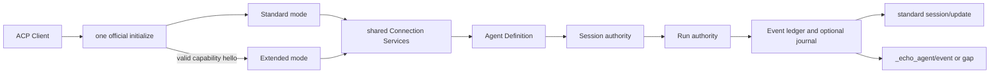

## Approach

- 先把当前“Schema 可描述但不可执行”的 core 合同收敛为官方 Rust SDK 可直接路由的 typed JSON-RPC 类型。Host advertisement 放在 `agentCapabilities._meta.echo_agent`，SDK Client hello 放在 `clientCapabilities._meta.echo_agent`；plain Client 不带 hello 时保持 Standard，只有 version、contract/source digest、required feature 与 capability 全部满足才进入 Extended。
- 现有 DTO 补官方 `JsonRpcRequest` / `JsonRpcResponse` / `JsonRpcNotification` derive，并同步冻结四个缺口：Client hello、单一 extension JSON-RPC error code + `EchoSdkError` data、可执行的 Agent/Session/Run typed payload、带 generation 的 Stream handle 与 `_echo_agent/event/ack`。已知 `_echo_agent/*` 不使用官方 2.1.0 raw extension fallback，避免其内部 `strip_prefix('_')` 行为改变 catalog method。
- 在根 `src/acp` 提取每连接唯一 `AcpConnectionServices`：它复用并扩展现有 `SessionRegistry`，新增薄 Run authority、receipt watch、取消/steer、Event ledger 与可选 journal。标准 `session/prompt` 与扩展 `run/start` 必须调用同一 `start_run`；同一个已接受 `EventEnvelope` 先提交 ledger，再产生标准 `session/update` 和扩展 `_echo_agent/event` 两个视图。
- `AcpAgentAdapter` 增加可组合 profile 入口，使用官方 `Builder::with_connection_builder` 合并 typed extension handlers；initialize、stdio、reader/writer、标准 handler 和 close chain 仍只建立一次。根 crate 不依赖 publish=false 的 `echo-sdk-protocol`，只暴露 protocol-neutral connection/session/run service。
- Host 的 `sdk-core-profile` feature 依赖 `runtime` 与 `echo-sdk-protocol`。只有显式 `sdk_profile.state_root` 和有界 limits 通过验证时才 advertisement/协商 core profile；未配置时当前标准 Host 行为不变。Host 保存 Agent definition/handle/generation/wire adapter，不复制 Session map、Run terminal、重试、取消或 event sequence。
- Agent handle 指向不可变构造 definition，每个 Session 仍构造独立 Agent。Agent create 使用版本化 typed config：可引用 Host default definition，也可提供 FrameworkConfig 的明确 wire 投影与互斥 inline/env credential source；不支持的 Tool/Store/callback/structured-output 配置 fail closed，留给后续 extension bridge/facade adapter outcome。
- 持久模式使用显式 state root：`FileRuntimeStateStore` 恢复 Agent checkpoint，`SegmentedFileEventJournal<EventEnvelope>` 保存每个 Run 的完整事件，Host 原子 generation/index 保存 handle incarnation 与 Run metadata。Host 重启不复活任意中断的 Driver future；旧 handle 返回 `stale_handle`，`session/load` 发放新 generation 的 Session/历史 Run/Stream handle，历史事件可 replay，新 Run 从已提交 checkpoint 继续。
- live notification 以 ACK cursor 约束 outstanding 数量。达到 event/byte bound 后只发一个 gap 并停止该 stream 的 live enqueue，Client 通过 bounded replay + ack 恢复；不依赖官方内部无界 notification queue 推断消费速度。输入 transport 在官方 `ByteStreams` 前加只计数、不解析 JSON 的 newline byte limiter，官方 SDK 继续独占 framing/parser/writer。

## Global Constraints

- 该能力属于通用 `echo-agent` framework；EKO discovery、GUI/TUI、产品权限、workspace 映射和产品持久化不进入本 Plan。
- Rust `AgentTurnDriver`、`TurnReceipt`、`EventEnvelope`、`CancellationToken`、`RuntimeStateStore` 与 `EventJournal` 是唯一执行/终态/恢复权威；Host adapter 不重新判断 completed/cancelled/failed。
- 官方 ACP 稳定 v1、`agent-client-protocol = 2.1.0` 与 schema `1.7.0` 继续精确锁定；禁止 `unstable_protocol_v2`、`unstable_*`、Proxy/Conductor 或私有基础协议。
- extension advertisement/hello 固定在 capability object 的 `_meta.echo_agent`，符合 ACP Extensibility；不得向标准类型根部增加私有字段。
- plain或协商失败的连接调用任意`_echo_agent/*` request返回官方method-not-found，notification按ACP规则忽略且不得改变状态；initialize本身仍按标准成功并允许Client继续Standard profile。已协商连接调用未advertisement的family返回typed capability mismatch。
- 本 Plan 只 advertisement `AgentLifecycle`、`SessionHandles`、`Runs`、`EventReplay`；`Runs` 包含 start/get/wait/cancel/steer，必须整组实现。TaskGraph、Subagents、ExtensionBridge、StructuredOutput 和 feature operation 不提前开放。
- semantic extension error 使用一个固定 JSON-RPC server-error code，`error.data` 为通过 bounds 校验的 `EchoSdkError`；malformed JSON/typed params 继续由官方 runtime 返回标准 parse/invalid-params/method-not-found。未协商或未知 extension request 返回method-not-found；extension notification按ACP规则忽略且不得改变状态。
- `source_contract_digest` 由contract generator按固定顺序、长度前缀的 SHA-256 覆盖 `Cargo.lock`、public facade inventory 与 parity manifest，并写入小型 `contracts/sdk/source-contract.json`；Host只嵌入该生成物，不嵌入大型inventory。它与extension schema `contract_digest`、ACP wire/version分开协商。
- `sdk_profile.state_root` 必须显式绝对路径，不搜索 cwd/home/`.env`/EKO 配置；Host generation 在同一 state root 内原子递增，旧 generation 绝不静默 rebind。
- Agent/Session/Run/Stream handle 校验顺序固定为 shape → kind → generation → issued/closed；同 generation 未发行 ID 为 invalid value，旧 generation 为 stale，已释放 ID 为 closed。Handle/idempotency/tombstone 数量全部受 Host limits 约束。
- `agent/create` 同一 idempotency ID + 同 canonical payload 返回同一结果；同 ID + 不同 payload 返回 typed conflict/invalid request，不借用 JSON-RPC request ID。
- 一个 Session 同时最多一个 active Run；标准 Prompt 与 extension Run 互斥。`run/start` 返回后异步执行，wait/close 等长操作必须 `ConnectionTo::spawn`，不得阻塞官方 dispatch loop。
- EventEnvelope 的 framework sequence/content hash/parent/identity 原样保留；journal record sequence 必须与 envelope sequence 对齐。journal append 失败或 outcome unknown 不能报告 Run success。
- replay 具有 stream handle generation fence、固定 requested watermark、event/byte/count 上限与 typed gap；terminal/receipt 由 Run snapshot 查询，event 不替代 snapshot。
- Host crash 后active Run恢复为新增`RunStatus::Interrupted`，run/get无terminal/receipt，run/wait返回typed `host_exited`；不得伪造completed terminal或从任意LLM/Tool指令位置自动续跑。新Run只从framework已提交checkpoint继续，已完成Tool事实不得重复执行。
- shutdown 顺序固定为 close admission → cancel active Runs/callback-free work → bounded wait receipts → flush journal/index → close Agents/MCP → release handles；stdin EOF 和 explicit close 共用该路径。
- stdio stdout 仍只有官方 ACP writer；日志与有界诊断走 stderr。byte limiter 只拒绝超限 newline frame，不实现 JSON-RPC parser/writer。
- 只交付源码；不提交/下载预编译 Host、npm/wheel/JAR 或 Node/Python/JDK/JRE/Rust runtime。
- Rust 生产代码禁止 `unwrap`、`expect`、panic/unreachable、可能越界的索引和 UTF-8 字节截断。

## Files

- Modify: `Cargo.toml` — 注册本阶段根 ACP runtime 公共面需要的 feature/依赖变化（若代码事实需要），保持 root package 可独立发布。
- Modify: `Cargo.lock` — 锁定 Host/protocol 依赖拓扑，不引入 unstable ACP artifact。
- Modify: `echo-sdk-protocol/src/capability.rs` — 增加 Client hello、meta key/helper、source contract digest 与 core limits。
- Modify: `echo-sdk-protocol/src/error.rs` — 冻结 JSON-RPC error code/data 编解码。
- Modify: `echo-sdk-protocol/src/methods.rs` — 将 Agent/Session/Run/receipt/config payload 收敛为可执行 typed DTO 并实现官方 RPC traits。
- Modify: `echo-sdk-protocol/src/event.rs` — 增加 Stream handle generation fence、ACK、恢复后的 Run/Stream 描述与 typed notification traits。
- Modify: `echo-sdk-protocol/src/catalog.rs` — 更新 core method/capability catalog，加入 `_echo_agent/event/ack`。
- Modify: `echo-sdk-protocol/src/schema.rs` — 导出修订后的 core schema、source digest 与 fixtures。
- Create: `echo-sdk-protocol/tests/core_rpc_contract.rs` — 验证 typed method、meta negotiation、error mapping、payload grammar、handle/ACK/replay round-trip。
- Modify: `contracts/sdk/schema/echo-agent-extension-v1.schema.json` — 生成新的 core profile 合同。
- Create: `contracts/sdk/source-contract.json` — 保存generator计算的source compatibility输入摘要与aggregate digest。
- Modify: `contracts/sdk/fixtures/extension/v1/` — 生成 hello、error、Agent/Session/Run、event ACK/replay/gap 正反例。
- Modify: `contracts/sdk/public-api.txt` — 记录根 ACP runtime 新公共面。
- Modify: `contracts/sdk/parity-manifest.json` — 为新增根 facade 项给出 ACP relationship 与三语言映射状态。
- Modify: `src/acp/mod.rs` — 导出可组合 profile 与 connection runtime 公共边界。
- Modify: `src/acp/adapter.rs` — 标准 handler 改为共享 connection services，并用官方 builder composition 接入可选 profile。
- Modify: `src/acp/session.rs` — 将既有 Session/active Turn 槽扩为可由标准与扩展共同调用的唯一 Session authority。
- Modify: `src/acp/projection.rs` — 从同一 ledger event 生成标准 ACP update，不再先投影后丢失完整事件。
- Create: `src/acp/runtime.rs` — 实现 protocol-neutral Run registry、receipt watch、cancel/steer、composite sink、bounded ledger 与 journal hook。
- Modify: `tests/acp_agent_adapter.rs` — 保持标准 profile 回归并验证标准 Prompt 与共享 Run authority。
- Modify: `echo-sdk-host/Cargo.toml` — 增加可隔离编译的 `sdk-core-profile` feature 和 protocol/state 依赖。
- Modify: `echo-sdk-host/src/config.rs` — 增加显式 sdk profile state root、frame/event/replay/handle/shutdown limits。
- Modify: `echo-sdk-host/src/factory.rs` — 抽取可复用 PreparedAgentDefinition，安装 FileRuntimeStateStore 并支持 create/load。
- Modify: `echo-sdk-host/src/lib.rs` — 组合标准 adapter、共享 services、core profile builder 与 bounded stdio。
- Create: `echo-sdk-host/src/bounded_stdio.rs` — 在官方 ByteStreams 前限制 newline frame bytes，不实现协议 parser。
- Create: `echo-sdk-host/src/core_profile/mod.rs` — 组装 advertisement、negotiation、typed handlers 与 close。
- Create: `echo-sdk-host/src/core_profile/handles.rs` — generation、kind、idempotency、issued/closed handle registry。
- Create: `echo-sdk-host/src/core_profile/handler.rs` — Agent/Session/Run/replay/ACK typed request dispatch。
- Create: `echo-sdk-host/src/core_profile/events.rs` — full event live delivery、ACK outstanding 与 gap bridge。
- Create: `echo-sdk-host/src/core_profile/persistence.rs` — generation/index、runtime checkpoint 与 per-run segmented journal adapter。
- Create: `echo-sdk-host/src/core_profile/wire.rs` — protocol DTO、framework receipt/status/error 的无损转换。
- Add: `echo-sdk-host/config.sdk.example.json` — 被测试读取的显式 core profile 配置。
- Add: `echo-sdk-host/tests/core_profile_e2e.rs` — 官方 Client + 真实 Host 子进程的协商、lifecycle、event、cancel/steer/replay/gap/restart/close 验收。
- Modify: `echo-sdk-host/tests/stdio_e2e.rs` — plain Client 忽略 advertisement 后标准 profile 全量回归。
- Modify: `.github/workflows/rust-ci.yml` — Linux Host group执行 core E2E，Windows binary 使用 all-features 编译。
- Modify: `README.md` — 记录 core profile 已交付但语言 SDK 尚未 Runnable。
- Modify: `README.zh.md` — 同步中文状态。
- Modify: `CHANGELOG.md` — 记录协商、共享 runtime、handles、events 与恢复边界。
- Modify: `docs/adr/0028-source-first-multilanguage-sdk-runtime.md` — 记录 core profile 最终运行时/恢复/背压决策。
- Modify: `docs/sdk/README.md` — 更新状态与 core profile 导航。
- Modify: `docs/sdk/protocol.md` — 更新 capability meta、typed method/error、ACK/replay/generation 合同。
- Modify: `docs/sdk/acp-agent-adapter.md` — 记录标准/扩展共用 connection services。
- Modify: `docs/sdk/acp-standard-host.md` — 记录 standard-only 与 sdk-profile 显式配置。
- Create: `docs/sdk/sdk-core-profile.md` — core profile 唯一外部使用/语义参考。

## Reuse

- `src/acp/adapter.rs` — `AcpAgentAdapter::connect_to` / `drive_prompt` — 保留唯一标准 ACP handler 与官方 connection loop，提取而非复制。
- `src/acp/session.rs` — `SessionRegistry` / `AcpSession` / `ActiveTurnLease` — 扩展当前唯一 Session、busy、cancel、close authority。
- `src/acp/projection.rs` — `AcpEventProjector` — 继续负责标准视图，但输入改为已提交的同一 EventEnvelope。
- `echo-orchestration/src/runtime/turn_driver.rs` — `AgentTurnDriver` / `TurnReceipt` / `TurnOutcome` / `EventSink` — 唯一 Run 执行、事件和终态来源。
- `echo-core/src/agent/event_envelope.rs` — `EventEnvelope` / `envelope_event_stream_after` — 保留 identity、sequence、content hash 与恢复续接。
- `src/agent/steer.rs` 与 `echo_core::agent::Agent::steer_input_tracked` — 复用现有 same-turn steering safe point。
- `src/state/file.rs` — `FileRuntimeStateStore` — 恢复 Session Agent checkpoint，不建立 Host 私有 transcript。
- `echo-state/src/journal/segmented.rs` — `SegmentedFileEventJournal` / retention metadata / prune — 持久完整 Run event 与 retained floor。
- `echo-core/src/utils/fs.rs` — `atomic_compare_and_swap` / `atomic_write` — generation/index 的原子更新。
- `echo-sdk-protocol/src/{capability,methods,event,error,handle}.rs` — 冻结 DTO/转换器 — 在既有合同上修订，不另建第二套 wire 类型。
- `contracts/sdk/source-contract.json` — 只嵌入generator预计算的小型摘要，不在Host binary重复嵌入public-api/parity大文件。
- `echo-sdk-host/src/factory.rs` — `DefaultHostSessionFactory` — 复用已验证 model client、逐 Session Agent 与 MCP 清理。
- official `agent-client-protocol` 2.1.0 — typed RPC derives、`Builder::with_connection_builder`、`ConnectionTo::spawn`、`ByteStreams` — 复用 dispatch/framing/cancel/close。

## Todos

### freeze-executable-core-contract

requirements:
- § 10.1 协议分层与通道纪律
- § 10.2 初始化与双 profile 协商
- § 10.4 echo-agent SDK extension families
- § 10.5 路径、数值与投影边界
- § 10.6 错误合同
- § 18. 版本与兼容策略

interfaces:
- consumes: 已冻结的 extension catalog、WireValue/scalars、WireHandle、WireEventEnvelope、官方 ACP typed RPC derive。
- produces: `EchoAgentClientHello`、capability meta helpers、`source_contract_digest`、typed Agent/Session/Run/receipt DTO、Stream-handle replay/ACK、extension JSON-RPC error mapping。

steps:

1. 修订 capability contract：在 Client/Agent capability `_meta.echo_agent` 编解码 hello/advertisement，分别验证 version、contract/source digest、required feature/capability 和 limits。
   verify: protocol contract tests覆盖 plain、valid、malformed、version/digest/feature/capability mismatch与排序去重。
   expected: Standard 与 Extended mode可由 initialize 输入唯一决定，协商失败不破坏标准 initialize且不创建handle。
2. 给所有本阶段 request/response/notification DTO 增加官方 typed RPC trait；冻结单一 JSON-RPC error code与bounded `EchoSdkError` data。
   verify: typed method exact-match、response round-trip、unknown/foreign method-not-found和错误 data正反例。
   expected: Host与未来语言Client不需要手写method字符串或解析message文本，且不使用raw fallback。
3. 将Agent/Session/Run的泛化WireValue占位收敛为版本化config、turn input、terminal/receipt与`Interrupted`结构；给Agent config提供Host-default与显式Framework投影两种分支，credential source互斥。
   verify: golden fixtures逐字段覆盖chat/execute、credential、Session cwd、cancelled/failed/completed receipt和unsupported structured output。
   expected: 三语言后续可从Schema生成同义API，Host无需猜payload tag或默认值。
4. 用Run+Stream handle替代裸stream_id寻址，新增RunStart/SessionLoad恢复描述、event ACK notification，以及Extended模式下标准session/new与session/prompt `_meta.echo_agent`的Agent/Session/Run/Stream handle桥接，并更新catalog/schema/source digest。
   verify: stale/kind/closed handle、cursor、ACK、replay limit、gap watermark和schema drift测试。
   expected: replay/ACK不能绕过generation fence，标准与扩展入口能引用同一对象，Runs capability与steer方法一致，生成合同可执行。

### extract-shared-acp-runtime

requirements:
- § 4.1 已有通用权威
- § 6.1 框架层
- § 10.3 标准 ACP operation families
- § 11.1 事件权威
- § 14.1 正常执行
- § 14.3 SDK 主动取消

interfaces:
- consumes: `AcpAgentAdapter`、existing SessionRegistry/ActiveTurn、AgentTurnDriver、EventEnvelope、TurnReceipt、optional EventJournal hook。
- produces: `AcpConnectionServices`、shared Session/Run authority、composable profile builder入口、ledger-first composite sink。

steps:

1. 将现有Session registry扩为每连接唯一services，允许标准default factory与扩展Agent definition factory创建同一种Session；保留one-active-run、cwd/MCP、cancel和close语义。
   verify: 现有adapter测试全量保持，新增标准/扩展Session互斥、跨Session并发和close竞争测试。
   expected: Host不需要第二个Session map；同一Session无论入口都引用同一Agent/history和active Run槽。
2. 提取start/get/wait/cancel/steer Run authority；start只登记并spawn一次Driver，status/terminal/receipt只从Driver和TurnReceipt推进。
   verify: start立即返回、wait不阻塞dispatch、cancel/自然完成竞争、steer accepted/drained/settled与exactly-one-terminal测试。
   expected: 标准Prompt和extension Run共享run ID、CancellationToken、receipt watch与terminal。
3. 实现ledger-first EventSink：按framework sequence提交完整envelope与journal hook，再把同一owned event交给标准projector和extension observer；Extended标准Session/Prompt response meta与EventNotification回传同一Run/Stream handle。
   verify: 标准update与full event的identity/sequence/terminal对应；journal失败、observer关闭和projector失败的receipt行为。
   expected: 两个profile只是同一事实的视图，不产生第二套sequence或terminal。
4. 用官方builder composition暴露可选profile注入；initialize只注册一次并由adapter写Host capability meta，所有长handler在connection task中运行。
   verify: plain adapter API、profile adapter API、method ordering、request cancellation、EOF/on_close回归。
   expected: 只有一个official connection/parser/writer/close chain，standard-only consumer不依赖echo-sdk-protocol。

### implement-negotiated-core-handles

requirements:
- § 8. SDK 对象模型
- § 10.2 初始化与双 profile 协商
- § 10.4 echo-agent SDK extension families
- § 13. Feature 模型
- § 15. 异常与边界场景

interfaces:
- consumes: typed core contract、AcpConnectionServices、PreparedAgentDefinition、sdk profile config。
- produces: negotiated `SdkCoreProfile` handlers、AgentDefinition/Session/Run/Stream handle registry、idempotency与close semantics。

steps:

1. 增加Host `sdk-core-profile` feature与显式配置；验证absolute state root、frame/event/replay/handle/shutdown limits，并保持`--no-default-features --features runtime`标准面可编译可运行。
   verify: config/example、feature tree、standard-only与core profile正反测试。
   expected: 未配置core时不advertise；配置有效时只advertise四个真实capability与准确acp/mcp feature。
2. 实现持久Host generation和有界handle registry，按shape/kind/generation/issued/closed顺序解析，记录parent ownership与idempotency payload digest。
   verify: forged、wrong kind、old generation、closed、ABA、max handles、同/异payload idempotency并发测试。
   expected: handle绝不rebind，关闭与重启错误稳定，registry无无限tombstone。
3. 将Host default或显式typed config准备为不可变Agent definition；每次Session create/load仍通过同一factory产生独立ReactAgent并安装state store。
   verify: multi-Agent definition、credential不泄漏、不支持配置fail closed、Session history/cwd/MCP隔离。
   expected: Agent handle不共享conversation state，extension bridge未交付的自定义trait不会被静默忽略。
4. 注册Agent create/describe/close、Session create/load/close、Run start/get/wait/cancel/steer typed handler；所有入口先检查Extended mode与capability。
   verify: handler成功、typed domain errors、method-not-found未协商、capability mismatch和close cascade。
   expected: full core lifecycle可经同一ACP connection完成，standard profile仍可独立使用。

### deliver-events-replay-recovery

requirements:
- § 11.1 事件权威
- § 11.2 Replay 与背压
- § 11.3 Session 与进程恢复
- § 14.3 SDK 主动取消
- § 15. 异常与边界场景
- § 16. 安全与本地边界

interfaces:
- consumes: shared Run ledger、typed Event/ACK/Replay contract、FileRuntimeStateStore、SegmentedFileEventJournal、Host generation/index。
- produces: bounded live Event/Gap notifications、durable replay、Session load和crash/restart recovery boundary。

steps:

1. 每Run建立event/count/byte bounded live subscriber和per-stream segmented journal；notification发送只在ACK outstanding窗口内，越界单次gap后暂停live。
   verify: fast/slow/no-ACK consumer、byte/count边界、ACK恢复、terminal retention和官方outgoing queue不无限enqueue。
   expected: Client可观察连续full events或明确gap，绝无静默丢失。
2. 实现bounded replay：固定请求watermark，从journal retained floor读取，校验embedded/journal sequence，返回next cursor和必要gap；非法/旧Stream handle先失败。
   verify: empty/suffix/limit/gap/pruned/corrupt/outcome-unknown/concurrent append replay矩阵。
   expected: replay结果通过`ReplayResponse::validate`，event不替代run/get snapshot。
3. 在显式state root保存generation、Session/Run索引与receipt metadata；Session load用FileRuntimeStateStore恢复Agent checkpoint，并给历史Run/Stream发当前generation的新handle。
   verify: 两次真实Host启动共享state root，旧handle stale、新handle replay/query可用，completed tool checkpoint不重复副作用。
   expected: 已提交上下文和events可恢复，extension binding不存在时不会隐式恢复。
4. 对crash时active Run记录`RunStatus::Interrupted`而非completed，不复活旧Driver；get保持无terminal/receipt，wait返回typed host-exited；close/EOF执行统一有界shutdown并flush authority。
   verify: kill-before-terminal、cancel/close/EOF、journal flush失败、MCP cleanup与orphan process测试。
   expected: 每个已结算Run仍只有framework terminal；未结算Run明确不可wait成success，新Run从checkpoint继续。
5. 在official ByteStreams前加入newline byte limiter，并在typed handler执行前复核序列化bounds；保留stdout单writer和secret redaction。
   verify: oversized pre-initialize/extension frame、UTF-8边界、malformed JSON、stdout framing和stderr secret sentinel测试。
   expected: 超限输入在无业务副作用时关闭/报错，项目不复制JSON-RPC解析。

### prove-and-document-core-profile

requirements:
- § 17. 源码布局与交付合同
- § 19. 文档与示例
- § 20.1 公共面完整性
- § 20.2 合同一致性
- § 20.3 行为一致性
- § 20.4 可靠性
- § 20.5 源码交付
- § 20.6 状态声明

interfaces:
- consumes: source-built Host、official Client typed core methods、two profile configs、contract/generation/replay fixtures。
- produces: real-process core E2E、CI矩阵、SDK core profile文档与最终影响证据。

steps:

1. 用官方Client启动真实Host，valid hello后完成Agent→Session→Run start/event/get/wait/replay/ack/close，并逐条解析stdout。
   verify: loopback model确定性success/steer/cancel场景和所有typed response/notification validators。
   expected: 本阶段四个capability在真实binary主路径可达，Run terminal/receipt与event一致。
2. 执行fail-closed矩阵：plain Client标准流程、malformed/mismatch hello、强行extension调用、unknown/foreign method与未advertise family。
   verify: standard initialize/new/prompt不回归；未协商零handle且method-not-found；capability错误使用typed data。
   expected: extension失败不会破坏ACP标准互操作，也不会偷偷降级。
3. 以同一state root重启Host，验证generation、Session load、历史query/replay、active crash与clean shutdown；以小limits制造真实backpressure gap。
   verify: 子进程timeout、PID/进程组、journal/index重开、旧/新handle和gap/ACK轨迹。
   expected: recovery、gap与Host退出结果可重复且没有假成功/泄漏。
4. 更新CI与正式文档；Host binary+两个被测试配置+真实E2E作为本阶段可执行示例，不新增面向最终语言用户的learning demo。
   verify: Linux core E2E、Windows all-features binary compile、文档命令/Schema/状态逐项一致。
   expected: docs/sdk仍是唯一入口；core runtime可用，但没有语言SDK完整路径，因此Runnable/Parity complete/Published仍未达到。
5. 重新生成并审查extension schema/fixtures、root inventory/parity，执行`./scripts/verify.sh`和AGENTS.md适用feature矩阵。
   verify: 合同生成后零漂移、root新增API全部分类、standard/core Host feature组合和17个根feature独立编译全部退出0零warning。
   expected: 最终tree不依赖未提交文件、绝对工作区或预编译项目产物。

## Diagram

## Decisions

- 参考官方 ACP Extensibility：自定义方法以下划线开头，扩展能力放 capability object `_meta`；因此使用`clientCapabilities/agentCapabilities._meta.echo_agent`，不修改标准字段。
- 参考官方 Rust SDK 2.1.0 typed derive与`Builder::with_connection_builder`：已知core method使用typed route并组合进现有adapter；不复制stdio/JSON-RPC/standard handler。
- 本地锁定 SDK 的raw extension enum会对method执行`strip_prefix('_')`；它适合未知extension passthrough，不作为冻结`_echo_agent/*`的业务路由。
- contract缺口不是另一个独立产品结果；hello/error/payload/ACK/handle修订只有与真实core handler一起才可独立交付，因此保留在同一`sdk-core-profile` Plan。
- `source_contract_digest`绑定可生成的源码兼容面并由小型source-contract生成物承载，不冒充完整Git tree hash；Git revision仍是源码交付边界，contract digest仍只描述extension schema/catalog。
- Agent handle保存definition而非共享conversation Agent，满足每Session独立history；Host default分支避免SDK重复传credential，显式分支满足多Agent。
- core profile要求显式持久state root，避免发现home/EKO路径；没有该配置时Host只提供已交付的standard profile。
- 恢复只承诺framework checkpoint与已提交event/index；不承诺崩溃后从任意外部LLM/tool指令中点复活原Driver。
- 新增ACK是有界live delivery的必要合同；仅依赖`send_notification`成功无法证明Client已消费，不能满足背压语义。未知或未协商ACK notification按ACP规则忽略，不产生伪响应。
- bounded stdio只包装raw input计数并委托official ByteStreams，避免官方Stdio当前无frame上限造成声明与实现不一致。
- `echo-website`继续不改，直到三语言Parity complete；SDK-Docs-Impact为更新framework SDK文档，SDK-Skill-Impact为none（不改Skill加载、激活、门禁或执行语义）。
- 设计§22保留设计批准时的历史基线；本Plan不修改design绑定。当前状态以completed Plan与`docs/sdk/README.md`为准，下一次design revision再改名或引用。
